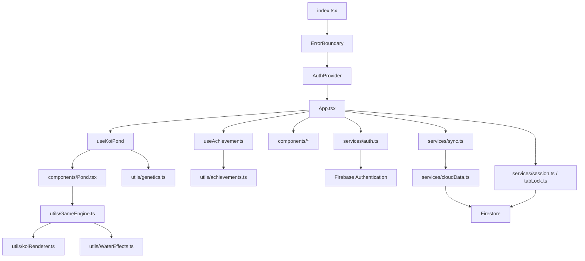

# Koiworld 에이전트용 게임·구조 가이드

> 이 문서는 Koiworld를 수정하거나 분석하는 에이전트가 먼저 읽어야 하는 현재 구현 기준 문서입니다.
>
> 최종 확인 기준: 2026-08-10

## 1. 이 문서의 목적

Koiworld는 코이를 키우고, 교배하고, 희귀한 유전 조합을 수집하며, 연못을 감상하는 캐주얼 육성 게임입니다.

에이전트는 작업을 시작하기 전에 다음 순서로 이해해야 합니다.

1. 이 문서에서 게임의 목적과 상태 흐름을 파악합니다.
2. 수정하려는 기능의 실제 소스 파일을 확인합니다.
3. 저장 상태, 렌더링 상태, 인증 상태 중 어느 레이어를 건드리는지 구분합니다.
4. 기존 게임 규칙을 바꾸는 경우에는 사용자 경험과 저장 데이터 호환성을 함께 검토합니다.

### 구현과 문서가 충돌할 때

현재 동작을 판단하는 우선순위는 다음과 같습니다.

1. 현재 소스 코드
2. `types.ts`, `firestore.rules`, `firebase.json`, `package.json` 등 실행 설정
3. `docs/`의 분석 문서
4. 과거 문서 및 Git 기록

README나 과거 문서에 적힌 기능이 현재 코드와 다르면 현재 코드를 기준으로 판단합니다. 특히 옥수수 효과, 야간 모드, 병듦 시스템은 과거 설명과 현재 구현이 다를 수 있습니다.

## 2. 게임 한눈에 보기

### 핵심 플레이 루프

```text
먹이 구매/수급
    ↓
연못에 먹이 뿌리기
    ↓
코이가 먹이를 먹고 성장·체력 회복
    ↓
성체 코이 선택
    ↓
교배하여 새로운 유전 조합 생성
    ↓
희귀 코이 육성 또는 판매
    ↓
ZP로 먹이·연못·트로피 구매
    ↓
업적 달성·랭킹 기록·연못 감상
```

### 게임의 주요 목표

- 코이를 치어에서 성체까지 성장시키기
- 색상, 점, 명도, 채도 유전 조합을 수집하기
- 성체 코이 두 마리를 교배해 자손을 만들기
- 점 개수와 희귀 유전 형질에 따른 업적을 달성하기
- 코이를 판매해 ZP를 얻고 연못을 확장하기
- 명예 트로피와 업적 점수로 랭킹에 참여하기

### 현재 플랫폼

- 웹: React + Vite 기반 PWA
- Android: Capacitor가 웹 빌드를 감싸는 Android 래퍼
- 인증/클라우드: Firebase Authentication + Firestore
- 호스팅: `firebase.json`의 Firebase Hosting 사이트 `koi-garden-abcf5`
- 네이티브 게임 로직: 별도 Kotlin/Java 게임 로직이 아니라 웹 TypeScript 코드가 담당

## 3. 전체 아키텍처



### 레이어별 책임

| 레이어 | 대표 파일 | 책임 |
| --- | --- | --- |
| 진입점 | `index.tsx` | React 루트 생성, ErrorBoundary와 AuthProvider 조립 |
| 앱 조립 | `App.tsx` | 전체 게임 상태, 사용자 이벤트, 모달, 저장 동기화 조정 |
| 게임 상태 | `hooks/useKoiPond.ts` | 연못, 코이, 먹이 펠릿, 성장·먹이 섭취·교배 보조 상태 |
| 업적 상태 | `hooks/useAchievements.ts` | 해금·수령 상태, 로컬/클라우드 업적 병합 |
| UI | `components/*` | 버튼, 모달, 연못 외부 UI, 정보 표시 |
| 캔버스 엔진 | `utils/GameEngine.ts` | 실시간 코이 이동, 먹이 추적, 충돌, 캔버스 루프 |
| 코이 렌더러 | `utils/koiRenderer.ts` | 세그먼트 기반 몸체, 무늬, 지느러미, 그림자, 클릭 판정 |
| 물 효과 | `utils/WaterEffects.ts` | 물 입자, 물결, 거품, 수질 오버레이 |
| 유전/경제 | `utils/genetics.ts` | 표현형, 교배, 유전, 코이 판매가 계산 |
| 인증 | `contexts/AuthContext.tsx`, `services/auth.ts` | Firebase 사용자 상태와 Google/Play Games/이메일 인증 |
| 저장 | `services/localSave.ts`, `services/sync.ts`, `services/cloudData.ts` | 로컬 저장, Firestore 저장·로드·랭킹 동기화 |

## 4. 앱 시작과 인증 흐름

### 앱 시작

1. `index.tsx`가 `App`을 `ErrorBoundary`와 `AuthProvider` 안에 마운트합니다.
2. `App.tsx`가 `localStorage`의 `SAVE_GAME_KEY`를 읽습니다.
3. 유효한 저장 데이터가 있으면 `useKoiPond` 초기 상태로 전달합니다.
4. `AuthProvider`가 Firebase 인증 상태를 복원합니다.
5. Android에서는 `initializeAndroidSession()`이 Play Games 로그인을 시도합니다.
6. Play Games 인증을 사용할 수 없으면 Firebase 익명 사용자로 fallback할 수 있습니다.
7. 로그인 사용자가 있으면 `App.tsx`가 프로필, 세션, Firestore 게임 데이터를 초기화합니다.

### 현재 인증 소스

`services/auth.ts`의 `AppUser`는 다음 정보를 제공합니다.

- `uid`
- `email`
- `displayName`
- `photoURL`
- `isAnonymous`
- `providerIds`
- `authSource`
- `authSourceLabel`

지원되는 인증 소스 타입은 `anonymous`, `playgames`, `google`, `email`, `phone`, `unknown`입니다.

Android Play Games 흐름은 다음과 같습니다.

```text
Android 앱 시작
    ↓
Firebase Auth 복원 대기
    ↓
Capacitor Firebase Authentication의 Play Games 인증
    ↓
Google ID token 또는 access token 획득
    ↓
Firebase Google credential로 연결/로그인
    ↓ 실패
익명 Firebase 사용자 fallback
```

익명 사용자를 Play Games 계정에 연결할 때는 기존 익명 UID의 게임 데이터를 보존하는 것이 중요합니다. `initializeAndroidSession()`은 먼저 현재 익명 사용자에게 credential을 link하려고 시도합니다.

## 5. 게임 상태 모델

### `SavedGameState`

저장되는 최상위 상태는 `types.ts`의 `SavedGameState`입니다.

| 필드 | 설명 |
| --- | --- |
| `ponds` | 연못 ID별 `PondData` 맵 |
| `activePondId` | 현재 보고 있는 연못 ID |
| `zenPoints` | 기본 게임 재화 ZP |
| `foodCount` | 기본 사료 보유 수 |
| `cornCount` | 프리미엄 옥수수 보유 수 |
| `honorPoints` | 명예 트로피 수 |
| `achievementPoints` | 업적 랭킹 점수 |
| `achievements` | 해금/수령한 업적 ID 목록 |
| `koiNameCounter` | 코이 이름/번호 생성용 카운터 |
| `timestamp` | 선택적 저장 시각 |

### `PondData`

각 연못은 다음을 가집니다.

- `id`
- `name`
- `kois`
- `decorations`
- `theme`
- `waterQuality` (0~100)

현재 연못 최대 개수는 상점 로직의 `4개`입니다. 한 연못의 코이 최대 수는 교배·구매 로직 기준 `30마리`입니다.

### `Koi`

코이의 핵심 필드는 다음과 같습니다.

- 식별/표시: `id`, `name`, `description`
- 유전: `genetics`
- 런타임 이동: `position`, `velocity`
- 성장: `age`, `growthStage`, `timesFed`
- 먹이 추적: `foodTargetId`, `feedCooldownUntil`
- 상태: `stamina`

성장 단계는 `GrowthStage.FRY`, `JUVENILE`, `ADULT`입니다.

### `KoiGenetics`

- `baseColorGenes`: 기본 색상 유전자 배열
- `spots`: 점 목록
- `lightness`: 기본 색상 명도 0~100
- `saturation`: 기본 색상 채도 0~100
- `spotPhenotypeGenes`: 점 표현형 유전자. 현재 핵심 유전자는 `CS`입니다.

`Spot`은 위치, 크기, 색상, 모양을 가집니다.

## 6. 먹이와 성장 규칙

### 사료 1개와 펠릿 3개를 구분해야 함

인벤토리의 사료 1개는 실제로 `dropFood()`에서 펠릿 3개로 뿌려집니다.

```text
인벤토리 기본 사료 1개 차감
    ↓
펠릿 3개 생성
    ↓
각 펠릿을 코이가 하나씩 먹음
    ↓
각 펠릿의 feedAmount만큼 timesFed 증가
```

현재 구현 기준:

| 먹이 | 인벤토리 1개당 펠릿 | 펠릿별 `feedAmount` | 실제 성장 수치 |
| --- | ---: | ---: | ---: |
| 기본 사료 | 3개 | 1 | 최대 3 |
| 옥수수 | 3개 | 3 | 최대 9 |

옥수수의 `feedAmount`는 `3`이며 기본 사료보다 3배 효과입니다. 기준 상수는 `App.tsx`의 `CORN_FEED_AMOUNT`입니다.

### 성장 임계값

`hooks/useKoiPond.ts`의 현재 값:

- 치어 → juvenile: `15` 성장 수치
- juvenile → 성체: `15` 성장 수치
- 총 필요 성장 수치: `30`
- 코이별 먹이 쿨다운: `3000ms`

기본 사료만 사용하고 펠릿이 모두 성장 대상 코이에게 들어간다고 가정하면, 코이 한 마리를 성체로 만드는 데 기본 사료 약 10개가 필요합니다. 실제 플레이에서는 다른 코이가 먹거나 펠릿이 이동하면서 효율이 달라질 수 있습니다.

### 먹이 섭취 효과

`handleFoodEaten()`은 펠릿이 실제로 먹혔을 때 호출됩니다.

- `timesFed` 증가
- 기본 사료: 스태미나 `+5`
- 옥수수: 스태미나 `+10`
- 스태미나는 최대 `100`
- 성장 임계값에 도달하면 성장 단계 변경 및 `timesFed` 초기화
- 먹힌 펠릿은 `foodPellets`에서 제거

### 수질과 스태미나 자연 변화

`useKoiPond`는 1초 간격으로 현재 연못을 갱신합니다.

- 코이 수에 비례하여 수질 감소
- 수질이 낮으면 스태미나 감소
- 질병/병듦 생성 로직은 현재 제거된 상태
- 치료제 아이템과 관련 UI도 현재 제거된 상태

수질 청소 비용은 `500 ZP`입니다.

## 7. 교배 규칙

교배 진입점은 `App.tsx`의 `handleBreedKois()`입니다.

교배 조건:

- 정확히 부모 코이 2마리 선택
- 두 코이 모두 성체
- ZP `200` 이상
- 연못에 최소 2칸의 여유 공간
- 부모 코이 각각 스태미나 `30` 이상

교배 결과:

- 자손 `2~5마리` 생성
- 부모 코이는 사라지지 않음
- 부모 코이 각각 스태미나 `30` 소모
- 수질 `4` 감소
- 자손은 치어로 시작
- `breedKoi()`가 부모의 유전 정보를 조합하고 변이를 적용

유전 관련 수정은 UI에서 임의로 값을 바꾸기보다 `utils/genetics.ts`의 표현형·교배 함수를 먼저 확인해야 합니다.

## 8. 판매가와 경제 시스템

### 판매가 계산 위치

모든 판매가는 `utils/genetics.ts`의 `calculateKoiValue()`에서 계산합니다. UI는 이 함수를 호출해 표시할 뿐, 별도의 판매가 공식을 가지면 안 됩니다.

현재 계산 요소:

1. 기본 가치
2. 발현 색상의 희귀도
3. 크림색이 아닌 기본 색상 보너스
4. 숨은 색상 유전자 보너스
5. 몸 명도와 기준값 50의 차이
6. 몸 채도와 기준값 50의 차이
7. 점 개수 단계 보너스
8. 점 색상 희귀도
9. 점 표현형 채도와 기준값 50의 차이
10. 성장 단계 배율
11. 스태미나 패널티
12. 최종 판매가 배율 `1.5`

### 현재 주요 판매가 보정

| 요소 | 현재 규칙 |
| --- | --- |
| 점 4개 이상 | `+50` |
| 점 8개 이상 | `+150` |
| 점 12개 이상 | `+400` |
| 치어 | 계산값 `0.4배` |
| juvenile | 계산값 `0.6배` |
| 성체 | 계산값 `1.0배` |
| 스태미나 41~60 | 계산값 `0.5배` |
| 스태미나 11~40 | 계산값 `0.25배` |
| 스태미나 10 이하 | 판매가 `0` |
| 최종 배율 | 계산된 값에 `1.5배` 후 내림 |

점의 개수만 보는 것이 아니라 점 색상, 명도, 채도, 기본 색상 유전자, 점 표현형도 판매가에 영향을 줍니다. 경제 밸런스를 수정할 때는 일반 코이만 보고 전체 배율을 바꾸면 희귀 코이 가격이 과도하게 상승할 수 있습니다.

### 현재 주요 경제 상수

| 항목 | 가격/수량 |
| --- | --- |
| 운영 초기 ZP | `2000` |
| 개발 환경 초기 ZP | `10000` |
| 기본 사료 | `200 ZP` / 50개 |
| 기본 사료 대용량 | `1000 ZP` / 250개 |
| 프리미엄 옥수수 | `1000 ZP` / 50개 |
| 프리미엄 옥수수 대용량 | `5000 ZP` / 250개 |
| 교배 | `200 ZP` |
| 연못 청소 | `500 ZP` |
| 연못 확장 | `20000 ZP` |
| 기본 크림 코이 구매 | `500 ZP` |
| 명예 트로피 | `100000 ZP` |
| 테마 변경 | 현재 모든 테마 무료 |

경제 상수는 `App.tsx`, 상점 UI는 `components/ShopModal.tsx`에 있습니다. 상수만 바꾸고 설명·버튼·검증 조건을 바꾸지 않는 수정은 피해야 합니다.

## 9. 캔버스 렌더링과 실시간 게임 루프

### 렌더링 흐름

1. `components/Pond.tsx`가 `<canvas>`를 만들고 `GameEngine`을 한 번 생성합니다.
2. `GameEngine.start()`가 `requestAnimationFrame` 루프를 시작합니다.
3. 매 프레임 `update()`에서 물 효과, 먹이 추적, 코이 물리, 코이 세그먼트를 갱신합니다.
4. 매 프레임 `draw()`에서 물 효과, 그림자, 코이, 거품, 먹이 펠릿을 그립니다.
5. 코이 클릭은 `Pond`가 캔버스 좌표를 엔진의 `getKoiAtPosition()`으로 전달하고 `KoiRenderer.hitTest()`가 판정합니다.

### 현재 렌더링 비용의 주요 원인

- `GameEngine`은 화면이 보이는 동안 계속 `requestAnimationFrame`을 실행합니다.
- 코이 한 마리당 물리 세그먼트가 `52개`입니다.
- 그림자와 몸체를 별도 패스로 렌더링합니다.
- 점 무늬를 몸체 클리핑 영역에 그립니다.
- `WaterEffects`가 매 프레임 물 입자와 표면 거품을 갱신합니다.
- 표면 효과가 매 프레임 그라디언트와 `shadowBlur`를 사용합니다.
- `components/Koi.tsx`와 `components/SingleKoiCanvas.tsx`에도 별도 `requestAnimationFrame`이 있으므로 모달 사용 시 중복 루프 여부를 확인해야 합니다.

휴대폰에서 60FPS가 보인다는 것은 프레임 속도가 유지된다는 뜻이지, CPU/GPU 사용량과 발열이 낮다는 뜻은 아닙니다.

### 렌더링 상태와 저장 상태를 구분할 것

`GameEngine` 내부 코이 위치는 실시간 애니메이션을 위한 런타임 상태입니다. React의 `ponds` 상태는 게임 저장·UI·규칙의 기준입니다.

렌더링 최적화 시 다음을 지켜야 합니다.

- 엔진 내부 위치 업데이트를 매 프레임 React `setState`로 올리지 않습니다.
- 저장해야 할 의미 있는 게임 이벤트와 단순 시각적 움직임을 구분합니다.
- `syncKois()`가 매 프레임 호출되지 않도록 합니다.
- 캔버스 루프를 정지해도 클릭, 먹이, 저장 기능이 깨지지 않는지 확인합니다.

## 10. 로컬 저장·클라우드 저장·세션

### 로컬 저장

`services/localSave.ts`에서 저장 키를 관리합니다.

- 현재 저장 키: `zenKoiGardenSaveData_v2`
- 수동 저장 키: `zenKoiGardenManualSaveData`
- 강제 초기화 broadcast 키: `zenKoiGardenForceClear_v1`

`App.tsx`는 현재 게임 상태를 JSON으로 만들고, 내용이 바뀐 경우에만 로컬 저장을 시도합니다.

### 클라우드 저장

로그인 후 `isCloudSyncReady`가 true가 되면 `App.tsx`의 주기 저장이 활성화됩니다.

- 현재 자동 저장 간격: `15초`
- 상태 JSON이 이전 클라우드 저장과 다를 때만 저장
- 이전 클라우드 저장이 끝나기 전에는 다음 주기 저장을 시작하지 않음
- `services/cloudData.ts`의 Firestore transaction으로 게임 상태 저장
- 저장 후 `rankings/{uid}`에 명예/업적 점수 갱신

업적 해금/보상 수령과 명예 트로피 구매에는 별도의 즉시 클라우드 저장 경로가 있습니다. 새로운 즉시 저장 경로를 추가할 때는 자동 저장과 겹쳐 Firestore 쓰기가 누적되지 않는지 확인해야 합니다.

### Firestore 구조

| 경로 | 목적 |
| --- | --- |
| `users/{uid}` | 개인 프로필, 세션, 전체 게임 상태 |
| `rankings/{uid}` | 랭킹 표시용 최소 점수/닉네임 데이터 |

`users/{uid}`의 핵심 필드:

- `profile.nickname`
- `profile.photoURL`
- `activeDeviceId`
- `gameState`
- `honorPoints`
- `achievementPoints`
- `updatedAt`

Firestore 보안 규칙은 `firestore.rules`를 기준으로 확인합니다. 저장 코드만 바꾸고 보안 규칙을 확인하지 않는 변경은 금지합니다.

### 저장 데이터 호환성

저장 상태를 변경할 때는 다음을 확인합니다.

- `isValidSavedGameState()`가 새 상태를 받아들이는가
- 기존 사용자 저장 데이터에 없는 필드의 기본값이 있는가
- `services/cloudData.ts`의 Firestore 변환이 새 필드를 보존하는가
- `utils/serializer.ts`를 사용하는 경로와 충돌하지 않는가
- 새 게임/로그아웃/클라우드 로드 시 기존 업적이 지워지지 않는가

업적은 한 번 해금되거나 수령된 기록을 되돌리지 않는 것이 현재 정책입니다. `useAchievements.ts`와 `cloudData.ts`는 로컬·클라우드 업적 ID를 합집합으로 병합합니다.

### 탭/기기 충돌 방지

- `services/tabLock.ts`: 같은 브라우저의 중복 탭 자동 저장 방지
- `services/session.ts`: Firebase 사용자 문서의 `activeDeviceId` 관리
- `services/cloudData.ts`: 세션 및 사용자 게임 문서 listener

중복 탭이 감지되면 현재 탭은 자동 저장과 먹이 입력을 멈출 수 있습니다. 저장 충돌 문제를 수정할 때 이 보호 장치를 우회하지 않습니다.

## 11. 업적과 랭킹

### 업적

업적 정의는 `utils/achievements.ts`에 있습니다.

현재 업적 조건은 대략 다음 범주로 구성됩니다.

- 점 개수 단계
- 점 색상
- 여러 색상 조합
- 명도·채도 극값
- 점 표현형 채도 극값
- 전설 점 조합

업적 상태는 다음 세 가지를 구분합니다.

- `unlockedIds`: 조건을 달성함
- `claimedIds`: 보상을 수령함
- `totalPoints`: 수령한 업적 점수 합계

한번 해금된 업적은 재계산 과정에서 사라지면 안 됩니다. 상태 초기화, 새 게임, 클라우드 로드 기능을 수정할 때 이 불변성을 반드시 유지합니다.

### 랭킹

`components/RankingModal.tsx`는 현재 다음 탭을 제공합니다.

1. 업적 랭킹
2. 트로피 랭킹

랭킹 데이터는 `rankings/{uid}`에 저장된 최소 점수를 읽습니다. 게임 전체 상태를 랭킹 문서에 복사하지 않습니다.

## 12. 주요 UI와 사용자 이벤트 진입점

| 기능 | UI | 로직 진입점 |
| --- | --- | --- |
| 먹이 선택/모드 | `ControlBar.tsx` | `App.tsx`의 포인터 이벤트, `useKoiPond.dropFood()` |
| 코이 선택 | `Pond.tsx`, `PondInfoModal.tsx` | `handlePondPointerDown`, `getKoiAtPosition` |
| 코이 상세/판매 | `KoiDetailModal.tsx` | `handleSell`, `calculateKoiValue` |
| 다중 선택/교배 | `App.tsx`, `PondInfoModal.tsx` | `handleBreedKois` |
| 상점 | `ShopModal.tsx` | 사료, 코이, 연못, 트로피 구매 핸들러 |
| 연못 정보 | `PondInfoModal.tsx` | 이동, 판매, 교배 |
| 업적 | `AchievementModal.tsx` | `useAchievements.checkAchievements/claimReward` |
| 랭킹 | `RankingModal.tsx` | `services/cloudData.getRankings` |
| 계정 | `AccountModal.tsx`, `AuthModal.tsx` | `AuthContext`, `services/auth` |
| 저장/새 게임 | `SaveLoadModal.tsx` | `handleNewGame`, 로컬/클라우드 상태 |
| 테마 | `ThemeModal.tsx` | 현재 테마 변경, 비용은 무료 |
| 청소 | `CleanConfirmModal.tsx` | `confirmCleanPond`, `cleanPond` |

## 13. 현재 구현에서 반드시 기억할 것

다음은 에이전트가 과거 문서만 보고 잘못 판단하기 쉬운 항목입니다.

- 병듦/질병 생성 로직은 제거된 상태입니다.
- 치료제 아이템과 관련 타입/UI도 제거된 상태입니다.
- `subtle-waves.png` 외부 배경 요청은 제거된 상태입니다.
- 옥수수는 현재 펠릿당 `feedAmount=3`이며 기본 사료보다 3배 효과입니다.
- 테마는 현재 모두 무료입니다.
- 야간 전환은 현재 비활성화되어 있습니다.
- 특수 색상 상점은 현재 기본 크림 코이 중심입니다.
- `components/Pond.tsx`는 DOM 장식과 캔버스 엔진을 함께 사용합니다.
- `App.tsx`가 크고 많은 책임을 가지고 있으므로 작은 수정도 저장·인증·UI에 영향을 줄 수 있습니다.
- `services/geminiService.ts`는 현재 실질적인 게임 기능에 연결되어 있지 않습니다.
- `index.html`은 Tailwind CDN을 사용합니다. 새로운 스타일 시스템으로 전면 교체하지 말고 현재 구성을 확인합니다.

## 14. 최적화 작업을 시작할 때의 권장 순서

최적화는 체감이나 코드 크기만 보고 진행하지 말고, 실제 기기 측정과 함께 진행합니다.

### 1단계: 기준선 측정

- Android 실기기에서 5~10분 플레이
- 코이 수별 발열과 배터리 변화 기록
- 개발 FPS 표시와 실제 입력 지연 기록
- 먹이 투입 전/후, 연못 정보 모달 전/후 비교
- Chrome DevTools Performance 또는 Android Studio Logcat 기록

### 2단계: 가장 위험도가 낮은 최적화

- 화면이 백그라운드일 때 `GameEngine` 루프 일시정지
- 보이지 않는 모달의 `requestAnimationFrame` 정리
- 물 거품 생성 빈도와 최대 개수 제한
- 불필요한 React 렌더링과 `syncKois()` 호출 확인

### 3단계: 렌더링 비용 조절

- 모바일에서 캔버스 해상도/DPR 상한 설정
- 모바일 코이 세그먼트 수 또는 렌더 패스 조정
- 그림자·`shadowBlur`·그라디언트의 모바일 대체 경로 검토
- 코이 수가 많을 때 먼 코이의 효과 단순화

### 4단계: 저장 비용 점검

- 저장 payload 크기 측정
- 실제 의미 있는 게임 이벤트와 1초 수질 갱신을 분리
- 자동 저장과 업적/구매 즉시 저장의 중복 여부 확인
- Firestore transaction 재시도 및 쓰기 빈도 확인

### 최적화 시 합격 기준

- 코이 이동과 먹이 섭취가 기존과 동일하게 동작
- 판매가·성장·교배 결과가 변경되지 않음
- 백그라운드 복귀 후 루프가 한 번만 재시작됨
- 클라우드 저장 누락/역행이 없음
- Android 실기기에서 발열과 입력 지연이 개선됨
- `npx tsc --noEmit`, `npm run build`, `git diff --check` 통과

## 15. 작업 전후 체크리스트

### 작업 전

- [ ] 이 문서와 관련 소스 파일을 읽었는가?
- [ ] 수정 대상이 React 상태인지, 엔진 런타임 상태인지, Firestore 상태인지 구분했는가?
- [ ] 현재 저장 데이터와 기존 사용자 호환성을 확인했는가?
- [ ] UI 설명과 실제 계산식이 일치하는가?
- [ ] 새 패키지 설치가 정말 필요한가? 필요하면 사용자 허락을 받을 것

### 작업 후

- [ ] `npx tsc --noEmit`
- [ ] `npm run build`
- [ ] `git diff --check`
- [ ] 모바일 화면에서 실제 탭/먹이/모달 동작 확인
- [ ] 로그인 사용자와 익명 fallback 모두 확인
- [ ] 로컬 저장 후 새로고침 확인
- [ ] 클라우드 저장 후 재로그인/다른 기기 로드 확인
- [ ] 관련 문서와 주석을 현재 구현에 맞게 갱신

## 16. 빠른 참조 파일 목록

### 게임 로직

- `App.tsx`
- `hooks/useKoiPond.ts`
- `hooks/useAchievements.ts`
- `utils/genetics.ts`
- `utils/achievements.ts`
- `types.ts`

### 렌더링/성능

- `components/Pond.tsx`
- `components/Koi.tsx`
- `components/SingleKoiCanvas.tsx`
- `utils/GameEngine.ts`
- `utils/koiRenderer.ts`
- `utils/WaterEffects.ts`

### 저장/인증/온라인

- `contexts/AuthContext.tsx`
- `services/auth.ts`
- `services/firebase.ts`
- `services/cloudData.ts`
- `services/sync.ts`
- `services/localSave.ts`
- `services/session.ts`
- `services/tabLock.ts`
- `firestore.rules`
- `firestore.indexes.json`

### 빌드/배포

- `package.json`
- `vite.config.ts`
- `firebase.json`
- `capacitor.config.ts`
- `android/app/build.gradle`
- `android/app/google-services.json`
